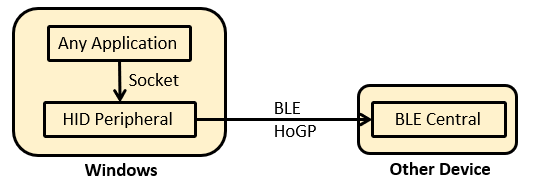
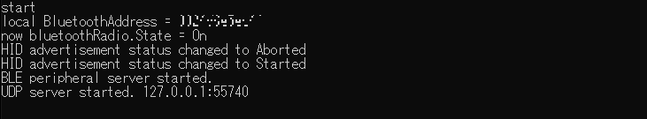

# WindowsHoGPPeripheral
English | [日本語](README_ja.md)

It is a Windows console application that uses C# and .NetFramework and operates as a HID remote control device for Bluetooth LE.
When connecting Windows and other devices with HoGP, it is common to use Windows as the Central side and receive input from Peripheral such as a BLE connection keyboard, but this time Windows will be the Peripheral side and implement the HID remote control function. .

## Requirements
### Hardware requirements
Requires hardware capable of using Bluetooth LE on Windows. Depending on the Bluetooth device (USB dongle, etc.) installed in Windows, there are some that can be used as the Central side but not as the Peripheral side, so confirmation is required.

As a confirmation method, if Virtual Peripheral and Virtual Keybord work normally with Microsoft tool: Bluetooth LE Explorer, it can be said that it can operate as Peripheral side.

https://apps.microsoft.com/store/detail/bluetooth-le-explorer/9N0ZTKF1QD98

Procure a USB dongle if it does not work as the peripheral side. TP-Link UB500 is confirmed to work.

### Software development environments
* Install Visual Studio 2019 Community
* Install Windows SDK
* Create a project for .Net Framework 4.7 Console Application
* Install Microsoft.Windows.SDK.Contracts with NuGet
* Migrate packages.config to PackageReference

## Source code
### bleHID.exe
It works as an HID remote control device and notifies the key code received by the UDP server from another process to the Central device.
As a point to note when building, it does not work with AnyCPU because it uses a library that turns off/on the Bluetooth hardware for the purpose of resetting BLE. Must be built on x86, x64, etc.

### bleHIDsockClient.exe
This is a sample of sending a key code to bleHID.exe with a UDP client.

## Usage

First, start bleHID.exe on Windows.
When started, bleHID.exe will start Advertise as HID device.

On the Central device, connect when you receive an Advertise.

Next, when bleHIDsockClient.exe is started on Windows, the sample automatically connects to bleHID.exe via UDP and sends the key code.

When you actually use this program, it is good to minimize bleHID.exe and start it, implement a UDP client on the application side to send the key code.

# Notes

* Many devices such as remote controllers on the market are powered by batteries and the Type is PUBLIC for power saving, but BD_ADDRESS Type is RANDOM when Windows is Peripheral like this app, It seems that. Therefore, the implementation on the Central side needs to handle changes in BD_ADDRESS.
* If you restart this app running on Windows, it seems that if you do not restart the Central side as well, it will fail with ErrorCode 574 or 532 when trying to connect after receiving Advertise.  
-> E NimBLEClient: "Connection failed; status=574"--> 0x 23E  
-> E NimBLEClient: "Connection failed; status=532"--> 0x 214  
https://github.com/h2zero/NimBLE-Arduino/issues/140  
Since it is impossible to restart the Central side, I added a process to turn BluetoothDevice OFF->ON when starting this app, but this may not be the correct method. I would be happy if you could tell me if there is a better way.

## License

MIT License

## Copyright

Naohisa Fukuoka, 2022

