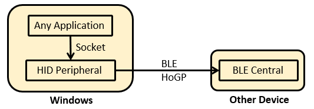

# WindowsHoGPPeripheral
[English](README.md) | 日本語

C#、.NetFrameworkを使い、Bluetooth LEのHIDリモコンデバイスとして動作するWindowsコンソールアプリです。
HoGPでWindowsと他の機器を接続する場合、WindowsはCentral側となりBLE接続キーボード等のPeripheralからの入力を受ける使い方が一般的ですが、今回はWindowsをPeripheral側としてHIDリモコンの機能を実装します。

## Requirement
### ハードウェア動作環境
Windows上でBluetooth LEが使用できるハードウェアが必要です。Windowsに実装されているBluetoothのデバイス(USBドングル等)によっては、Central側としては使えてもPeripheral側としては使えないものも存在しますので確認が必要です。

確認方法としては、microsoft製ツール: Bluetooth LE ExplorerでVertual PeripheralやVertual Keybordが正常に動作すれはPeripheral側として動作できていると言えます。

https://apps.microsoft.com/store/detail/bluetooth-le-explorer/9N0ZTKF1QD98

Peripheral側として動作しない場合は、USBドングルを調達します。TP-Link UB500は動作確認が取れています。

### ソフトウェア開発環境
* Visual Studio 2019 Communityをインストール
* Windows SDKをインストール
* .Net Framework 4.7 コンソールアプリケーションのプロジェクトを作成
* Microsoft.Windows.SDK.ContractsをNuGetでインストール
* packages.config を PackageReference に移行

## Source code
### bleHID.exe
HIDリモコンデバイスとして動作し、UDPサーバーが別プロセスから受信したキーコードをCentral機器へ通知します。
ビルド時の注意点として、BLEのリセットの目的でBluetoothハードウェアのOFF/ONを行うライブラリを使用しているためAnyCPUでは動作しません。x86, x64などでビルドする必要があります。

### bleHIDsockClient.exe
UDPクライアントでbleHID.exeへキーコードを送るサンプルです。

## Usage

まず、Windows上でbleHID.exeを起動します。
起動すると、bleHID.exeはHID機器としてAdvertiseを開始します。

Central機器で、Advertiseを受けたらConnectします。

次に、Windows上でbleHIDsockClient.exeを起動すると、サンプルでは自動でbleHID.exeへUDPで接続してキーコードを送信します。

このプログラムを実際に使うときには、bleHID.exeは最小化して起動しておき、作成するアプリ側にはUDPクライアントを実装しキーコードを送ると良いです。

# Note

* 市販のリモコン等のデバイスは電池で動き省電力化のためTypeはPUBLICになっているものが多いのですが、このアプリのようにWindowsをPeripheralにした場合のBD_ADDRESSのTypeはRANDOMが使われるようです。よって、Central側の実装にはBD_ADDRESSが変更される事への対応が必要です。
* Windows上で動作しているこのアプリを再起動した場合、Central側も再起動しないとAdvertiseを受けた後、Connectしようとして ErrorCode 574や532で失敗するようです。
-> E NimBLEClient: "Connection failed; status=574"--> 0x 23E
-> E NimBLEClient: "Connection failed; status=532"--> 0x 214
https://github.com/h2zero/NimBLE-Arduino/issues/140
Central側の再起動は不可能なため、このアプリの起動時にBluetoothDeviceをOFF->ONする処理を入れて対策しましたが、これは正しい方法ではないかもしれません。より良い方法があれば教えていただけると嬉しいです。

## License

MIT License

## Copyright

Naohisa Fukuoka, 2022
